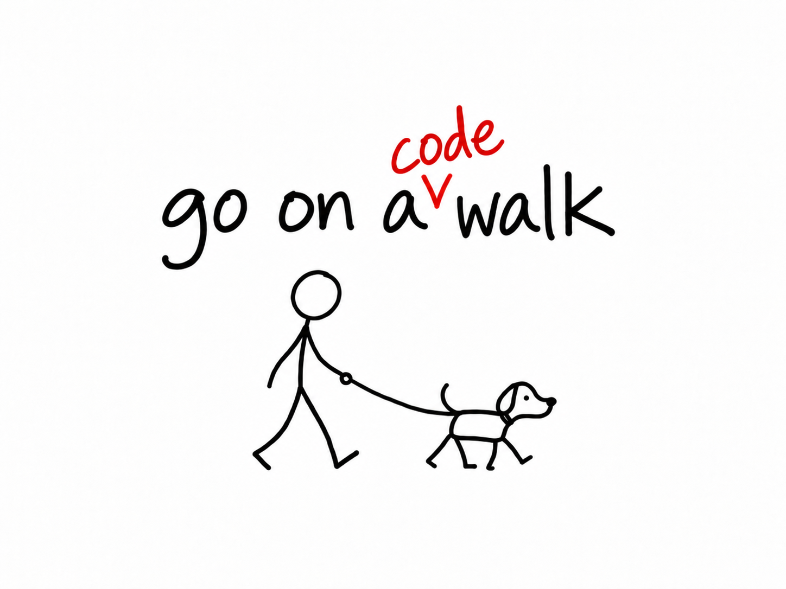

<p align="center">
  
</p>

<p align="center">
  <a href="SKILL.md"></a>
  
  <a href="LICENSE"></a>
</p>

# Go on a Code Walk

Turn a Go merge request into a visual story a reviewer can follow.

Go on a Code Walk is an explicit Codex skill. It reads the MR, its commits, the relevant code and tests, and optional Jira context. It then creates a self-contained HTML report showing how behavior changes instead of retelling the diff file by file.

The report is deliberately high-level. Code evidence stays close at hand in collapsed sections when the reviewer needs it.

## What it does

- Verifies the exact remote MR revision before analysis.
- Uses pasted Jira context, or an explicit `no ticket`, to understand intent.
- Shows complete before-and-after flows for changed behavior.
- Shows a single connected flow for wholly new features.
- Adds short, collapsible explanations for project-specific concepts.
- Links evidence to exact files and revisions when the MR host permits it.
- Creates one local HTML file with no remote scripts, fonts or images.
- Reads tests as documentation but leaves test execution to the pipeline.

It does not modify the reviewed repository or replace a defect-focused code review.

## Requirements

- Codex with local skill support.
- Git.
- A Go repository containing `go.mod`.
- An actual GitHub pull request or GitLab merge request.
- Authenticated access to the MR through an available CLI, app or connector.

## Installation

Clone the repository and symlink it into your personal Codex skill directory:

```sh
git clone https://github.com/brainmaniac/go-on-a-code-walk.git
cd go-on-a-code-walk
mkdir -p "$HOME/.agents/skills"
ln -s "$PWD" "$HOME/.agents/skills/go-on-a-code-walk"
```

OpenAI's [skill documentation](https://learn.chatgpt.com/docs/build-skills) describes the supported skill locations. Some Codex installations use `$CODEX_HOME/skills` instead; use that directory when it is configured.

If the skill does not appear immediately, restart Codex and check `/skills`.

## Usage

Open Codex in the repository with the MR branch checked out, then invoke:

```text
$go-on-a-code-walk
```

You can also identify the MR explicitly:

```text
$go-on-a-code-walk https://github.com/example/project/pull/123
```

The skill will:

1. Resolve the MR, target branch and remote source SHA.
2. Ask you to paste the Jira ticket text or answer `no ticket`.
3. Inspect the changed behavior and its surrounding code.
4. Show its understanding for confirmation.
5. Generate the HTML walkthrough and return a local link.

The report language follows the language you use with Codex.

## Privacy and safety

The generated page loads no external assets or tracking code. It may still contain source excerpts, repository paths and MR metadata. Treat it like source code and review it before sharing it outside your organization.

Jira text is used as analysis input. The report only retains the ticket identifier and link when supplied.

## Future development

- Add an optional code-lens mode with a closer connection between flow steps, the diff and exact source lines. The default view should remain high-level.
- Let the reviewer choose an experience level so the report can vary the amount of Go, domain and architecture explanation without changing the underlying analysis.
- Refresh an existing walkthrough after new commits and highlight what changed since the previous MR revision.

## Contributing

Issues and focused pull requests are welcome. Keep the default workflow small, local and useful to someone trying to understand an MR.

## License

[MIT](LICENSE)
